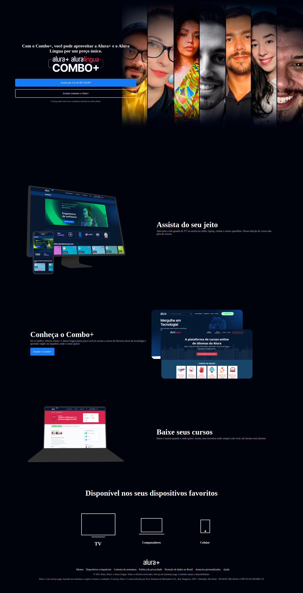

# Alura +

# Sobre o projeto

O projeto é uma landing page desenvolvida ao final do curso de HTML e CSS da <a href="https://www.alura.com.br/">Alura</a>. Foram utilizadas as principais funcionalidades do CSS como display flex e grid, além disso o site é totalmente responsivo.

Link do site: https://tm-alura-plus.netlify.app/

##  👩‍💻 Demonstração

## 🚀 Tecnologias Usadas

- ✔️ [HTML](https://developer.mozilla.org/pt-BR/docs/Web/HTML)

- ✔️ [CSS](https://developer.mozilla.org/pt-BR/docs/Web/CSS)

